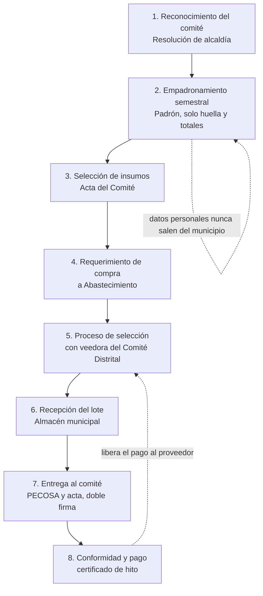

# Institutional Signer Kit

## La pieza que le faltaba a Stellar para entrar al sector público latinoamericano

**Postulante:** TECH GOB CONSULTORA EN TRANSFORMACIÓN DIGITAL Y TECNOLOGÍAS EMERGENTES SpA (TechGob), Chile
**Validación en terreno:** Municipalidad Provincial de Tocache (San Martín) y Municipalidad Distrital de La Punta (Callao), Perú, con acceso habilitado por la Red Nacional de Laboratorios de Innovación Digital de la SGTD
**Esta iteración:** USD 5 000 · 30 días · **Iteración siguiente:** USD 8 000 · 6 semanas
**Este documento es el Statement of Work público de la postulación.**

---

## 1. La tesis

Stellar no pierde casos de uso públicos por capacidad técnica. Los pierde porque ninguna entidad estatal puede comprar, custodiar ni rendir cuentas de un criptoactivo para pagar comisiones de red.

Construimos el componente que elimina ese obstáculo, y lo entregamos abierto. El caso municipal ya no es el producto: es la prueba de que funciona.

## 2. La evidencia de que este obstáculo decide arquitecturas

TechGob y la Secretaría de Gobierno y Transformación Digital del Perú (SGTD) levantaron, en un taller conjunto, 23 desafíos públicos con definición suficiente para evaluación técnica, provenientes de 25 entidades del programa. El análisis de portafolio es material de trabajo con la SGTD; podemos exponerlo al comité bajo acuerdo de confidencialidad. Lo que sigue es su resultado agregado.

La distribución por arquetipo técnico es la siguiente:

| Arquetipo | Casos | Red recomendada hoy |
|---|---|---|
| Notarización documental | 8 | Besu (6), Ethereum (2) |
| Interoperabilidad multientidad | 5 | Besu (5), Avalanche (5) |
| Credenciales verificables | 5 | Besu (5) |
| Gobernanza jerárquica | 3 | Besu (3), Avalanche (1) |
| Liquidación de valor | 2 | **Stellar (2)** |

**Stellar aparece hoy en 2 de 23 casos.** No porque no sirva para los otros trece de notarización y credenciales, que son técnicamente triviales para la red, sino porque el criterio que decidió la cartera fue operativo: una red permisionada sin token no obliga a la entidad a tener activos, y una red pública sí.

Ese es exactamente el obstáculo que resuelve este componente. **El kit convierte a Stellar en candidata viable para trece casos adicionales del mismo portafolio**, sin cambiar una línea de la norma peruana.

Esa es la razón por la que este pedido le sirve al ecosistema más que al proyecto que lo presenta.

## 3. El componente

Soroban separa la autorización del pago dentro del propio protocolo. Las entradas de autorización se firman de forma independiente del sobre de la transacción, de modo que quien autoriza una invocación y quien paga su comisión pueden ser cuentas distintas.

Sobre esa propiedad construimos el **Institutional Signer Kit**, con cuatro piezas:

1. **Firma institucional por rol y ciclo.** Claves asignadas a cargos y períodos, no a personas, con rotación documentada. Cumple la restricción de protección de datos que impone la Ley N.° 29733 y su reglamento.
2. **Relayer con política restringida.** El operador que paga solo puede transmitir invocaciones de contratos y funciones autorizadas, con topes de gasto y límite de frecuencia. No puede usar su rol de pagador para otra cosa.
3. **Trazabilidad entre comisión y autorización.** Cada comisión pagada queda enlazada a la entrada firmada que la originó. Es lo que permite auditar al operador.
4. **Portabilidad y no censura.** La entrada firmada se publica. Si el operador desaparece o se niega a transmitirla, cualquier tercero puede hacerlo mientras no expire. El operador opera el registro, no lo controla.

Para la entidad pública el resultado es: saldo cero en XLM, ninguna partida presupuestal que crear, ninguna custodia de activos, y una autorización acotada en objeto y plazo, que es el equivalente criptográfico de una delegación de firma.

## 4. Dónde encaja en el ecosistema Stellar

La Stellar Disbursement Platform resuelve el tramo de abajo: registra al receptor mediante SEP-24, verifica su contacto con una clave de un solo uso y envía los pagos masivos. Responde quién recibió.

Nadie responde el tramo de arriba: **quién decidió el beneficio, con qué acto administrativo y bajo qué regla**. Esa integridad documental del lado del otorgante es hoy un archivo PDF escaneado en un portal municipal.

Nuestro registro cubre ese tramo. Modela el ciclo legal como máquina de estados y rechaza en red las transiciones que la norma no permite. El resultado es un certificado de hito verificable que un desembolso puede consumir como precondición.

La secuencia completa queda así: **acto administrativo verificable → hito certificado → desembolso**. Los dos extremos ya existen en Stellar. Este proyecto construye el eslabón del medio.

### Hacia dónde escala, y por qué no es el presupuesto participativo

El presupuesto participativo es el banco de pruebas, no el mercado. Tiene el flujo claro, base legal estable, ningún dato sensible y ningún sol en movimiento, así que permite probar la máquina de estados completa sin arriesgar nada. Esa es su virtud y también su techo: en ese proceso el dinero nunca llega a un ciudadano, va a una obra contratada, de modo que el camino no termina en una billetera.

Donde el patrón pasa a valer dinero es en los beneficios que el Estado entrega persona por persona. El caso inmediato es el **Programa del Vaso de Leche**, y por eso entra en la Etapa 2 con un hito propio, no como proyección lejana. Tres datos explican la diferencia de escala:

| | Presupuesto participativo | Vaso de Leche |
|---|---|---|
| Frecuencia | Un ciclo al año | Entrega mensual |
| Eventos por entidad al año | Unos 14 | Unos 600 en un distrito con 50 comités |
| Quien firma la constancia | Un comité de vigilancia de 4 personas | Los comités del programa, que reciben o no reciben la ración |

Según el MIDIS, en mayo de 2026 el programa atendía a más de 1,6 millones de personas a través de más de 38 mil comités, correspondientes a 1 101 gobiernos locales. Esos comités son el mejor testigo posible: no necesitan interpretar un expediente para saber si la entrega llegó, y son los únicos con incentivo directo en reportar cuando no llega.

Hay además una obligación legal que empuja la adopción. La municipalidad, bajo responsabilidad funcional del titular del pliego y de los funcionarios responsables, debe remitir la información actualizada al MIDIS y a la Contraloría, y el padrón se actualiza cada semestre. El producto deja de venderse como transparencia voluntaria y pasa a venderse como cumplimiento.

Y el dolor está documentado. Este año la Contraloría intervino la Municipalidad de Ate porque dos comités denunciaron no recibir insumos desde enero, pese a una partida de S/ 6,8 millones con cerca de 20 % de avance y un contrato vigente por S/ 2,8 millones para adquirir leche y avena. La verificación consistió en que un auditor fuera a contrastar testimonios con documentos. Con cada comité atestiguando su entrega mensual, esa inspección se vuelve una consulta.

De ahí se sigue la línea de vales y billeteras con subsidios de destino específico —alimentos, experiencias culturales, transporte—, donde el beneficio llega atado a la decisión que lo justificó y limitado al uso aprobado. Stellar ya tiene las primitivas nativas para restringir la circulación de un activo. Esa línea queda en las etapas 3 y 4, porque hoy la ley destina los recursos del programa a financiar la ración y entregar valor a una billetera exige cambio normativo. El orden importa: primero se vuelve verificable la decisión, después se mueve el valor. Un vale alimentario sin acto verificable detrás solo digitaliza el problema.

## 5. Tracción

**Verificable hoy:**

- Portafolio de 23 desafíos públicos con evaluación técnica por arquetipo, levantado junto a la SGTD sobre la base de un diagnóstico y un taller conjunto, con 25 entidades participantes y 100 % de ellas con interés declarado en desarrollar pilotos. Entre esos desafíos está el de la Municipalidad Distrital de La Punta, sobre notarización de certificados digitales en blockchain, que es nuestro segundo piloto.
- Relación formal con la SGTD y con la Red Nacional de Laboratorios de Innovación Digital.
- Trabajo de campo previo con el Laboratorio de Gobierno del Ministerio de Hacienda de Chile, que muestra que el patrón se repite fuera del Perú.
- Trabajo propio ya invertido, unas 45 horas de diseño equivalentes a USD 900 a nuestras tarifas, publicado en el repositorio: máquina de estados derivada artículo por artículo de las normas de ambas municipalidades, incluida la variante de génesis en dos piezas que usa La Punta; contrato de datos con reglas de admisión por campo; validador en dos capas, con siete casos de prueba, que detectó 16 inconsistencias en la ordenanza real de Tocache; y análisis forense de los documentos de ambas entidades, que verificó las siete firmas digitales del decreto de La Punta y comprobó que carecen de sello de tiempo cualificado y de datos de validación de largo plazo.
- Prueba de concepto en testnet de la pieza central: una clave de rol firma la autorización de una invocación y una cuenta distinta paga la comisión y la transmite. El enlace a la transacción está en el repositorio.

**Lo que no anticipamos** es precisamente lo que esta iteración financia: el contrato de génesis con sus guardas, la ingesta de los dos perfiles de documento, el verificador ciudadano y el empaquetado del kit como componente reutilizable.

**Comprometido para esta etapa:** dos municipalidades piloto, con acceso habilitado por el laboratorio de la SGTD, y actividades conjuntas de capacitación a funcionarios y ciudadanos para acompañar la adopción.

### Por qué estas dos municipalidades

No son dos casos: son los dos extremos del problema.

**Tocache** es el caso opaco. Provincia amazónica de San Martín, sin actas ni informes finales del proceso publicados. Su Anexo 1 agrupa las fases de concertación, coordinación y formalización en un solo bloque de dos filas, sin asignar fecha a la suscripción del Acta, a la elección del Comité de Vigilancia ni a la rendición de cuentas, que los artículos 14, 26 y 31 de su propio reglamento exigen. Y las dos fuentes internas del documento se contradicen: la remisión al MEF figura en la III semana de febrero en el anexo y el 31 de marzo en la convocatoria.

**Ninguna de las dos es un caso de incapacidad de gasto, y ese es justamente el punto.** Al cierre de 2025, según el reporte de desempeño presupuestal municipal del Congreso elaborado con datos del MEF:

| Al cierre de 2025 | Tocache | La Punta |
|---|---|---|
| Avance del presupuesto total | 74,9 % | 90,9 % |
| Avance del gasto corriente | 82,6 % | 92,5 % |
| Avance del gasto de capital | 55,5 % | 67,1 % |
| Presupuesto de inversión modificado | S/ 41 296 542 | S/ 2 707 002 |

Dos municipalidades que gastan lo que se les asigna, y aun así ninguna deja una cadena de evidencia que conecte lo que los vecinos acordaron con lo que efectivamente se hizo. El problema no es la capacidad de gasto, y ningún aumento de capacidad lo resuelve.

El cuadro añade un tercer eje de diversidad al piloto. Tocache maneja un presupuesto de inversión quince veces mayor que el de La Punta, que es un distrito de estructura administrativa: casi todo su gasto es corriente. El registro debe servir donde el presupuesto participativo mueve obra pública de escala provincial y donde asigna montos pequeños de mejora local. Si funciona en ambos, funciona en el resto del país.

**La Punta** es el caso digitalizado. Distrito del Callao, uno de los más pequeños del país, publica su proceso completo —cinco ciclos consecutivos, de 2023 a 2027— y emite documentos nativamente digitales. Su Decreto de Alcaldía N.° 002-2026-MDLP/AL, que convoca el proceso 2027 y aprueba el cronograma, lleva **siete firmas digitales válidas** con certificados FAU emitidos a nombre de la municipalidad, algunos en token físico y otros en software, con hash SHA-256 y la firma final cubriendo el documento completo.

**El eje que separa a los dos pilotos es el nivel de digitalización de la firma**, y de ahí se derivan dos perfiles de ingesta distintos:

| | Tocache | La Punta |
|---|---|---|
| Origen del documento | Escaneado de un impreso | Nativo digital |
| Autoría | Firma manuscrita y sellos de visto bueno | Siete certificados FAU verificables |
| Integridad | Ninguna: el PDF se armó al digitalizar | Criptográfica, con hash SHA-256 |
| Extracción de datos | OCR con errores | Texto estructurado |
| Validación en la ingesta | Doble revisión humana | Verificación automática más revisión simple |

Los dos perfiles ya están previstos en el contrato de datos, que define por campo si la validación es automática, simple o doble. Esta etapa los prueba contra documentos reales de ambos tipos.

**Y aquí aparece el hallazgo que justifica el registro incluso en la entidad que hace bien su trabajo.** Las siete firmas de La Punta son válidas, pero carecen de sello de tiempo cualificado y de datos de validación de largo plazo: la hora de firma la declara el reloj del propio firmante, y verificar la cadena exige disponer de la lista de confianza peruana en el momento de la consulta. Un verificador externo, hoy, reporta emisor desconocido. Para un documento que debe seguir siendo verificable dentro de quince años, cuando los certificados hayan expirado, eso no alcanza.

La firma digital prueba quién firmó. El anclaje prueba cuándo existió y que la serie está completa. Son propiedades distintas y complementarias: el registro no reemplaza la firma FAU, la extiende en el tiempo. En Tocache aporta la integridad que no existe; en La Punta, la permanencia que la firma sola no garantiza.

Un detalle de modelado que solo apareció al leer este decreto: en La Punta la génesis del ciclo tiene dos piezas, porque el artículo 18 de su ordenanza marco delega en un Decreto de Alcaldía la convocatoria y el cronograma anual. La máquina de estados debe admitir esa variante, que probablemente sea la regla y no la excepción en municipios con ordenanza marco.

## 6. Modelo de negocio y sostenibilidad

El código se publica abierto. Lo que TechGob vende es la incorporación, y ese modelo ya está definido con tres mecanismos:

| Mecanismo | Qué es | Rango | Consume tiempo del equipo |
|---|---|---|---|
| Licencia del framework de onboarding | Procesos técnicos, normativos y operativos documentados que una entidad adopta | USD 15 000 – 40 000 por institución | No |
| Contrato de implementación | Despliegue en la entidad, integración con sistemas existentes, capacitación | USD 25 000 – 80 000 por institución | Sí, acotado |
| Mantenimiento y actualización normativa | Monitoreo de cambios legales y actualización del estándar | 15–20 % anual del contrato inicial | Marginal |

El primero y el tercero están desacoplados del tiempo del equipo: crecen sin crecer en horas. El segundo consume tiempo, pero es finito y produce el caso de éxito que habilita al primero en la siguiente entidad.

**Tamaño del mercado en Perú:** 19 ministerios, 26 gobiernos regionales, 1 874 municipalidades y 51 universidades públicas. La estimación conservadora de TechGob es de 80 instituciones con alta probabilidad de adopción en tres años, a un contrato promedio de USD 45 000, es decir unos USD 3,6 millones solo en Perú, con 17 proyectos ya identificados con la SGTD. La expansión natural es Colombia, Ecuador y Chile, con marcos normativos compatibles.

**Y aquí está el punto para el ecosistema:** ese mercado hoy está mayoritariamente asignado a redes permisionadas. El patrocinio de comisiones es lo que lo vuelve disputable para Stellar. Cada implantación que TechGob venda financia, como costo marginal, la operación del pagador de comisiones de esa entidad. La sostenibilidad del registro no depende de subsidios ni de fondos públicos: depende de un negocio que ya tiene precio y demanda declarada.

**La ruta del operador es del proveedor al Estado.** En las etapas 1 y 2 paga TechGob. Después, el laboratorio de la SGTD, que es donde debe vivir una función pública. Como el diseño admite varios pagadores autorizados, el traspaso es un cambio de configuración, no una migración.

## 7. Qué financia esta iteración (USD 5 000, 30 días)

| # | Entregable | Criterio de aceptación |
|---|---|---|
| E1 | Institutional Signer Kit v1, abierto | Una entidad firma una invocación sin tener XLM; el operador paga; la entrada firmada es transmisible por un tercero |
| E2 | Registro del ciclo, transiciones T0 a T8, en testnet | Toda transición inválida es rechazada por la red, con prueba automatizada, y los cinco ciclos publicados de La Punta se ingestan sin excepciones manuales |
| E3 | Investigación de usuario en Tocache y La Punta | Requerimientos cerrados y firmados con la oficina de planeamiento y presupuesto de cada entidad |
| E4 | Validador de ingesta v2 y verificador ciudadano | Un tercero reproduce las huellas sin intervención de TechGob |
| E5 | Medición del costo real de comisiones por transición | Cifra publicada, base del argumento de sostenibilidad |

| Rubro | Horas | Monto |
|---|---|---|
| Desarrollo Soroban | 120 | USD 2 400 |
| Gestión institucional e investigación de usuario | 70 | USD 1 400 |
| Trabajo de campo en Tocache y La Punta | — | USD 600 |
| Infraestructura | — | USD 250 |
| Contingencia | — | USD 350 |
| **Total** | **190** | **USD 5 000** |

Tarifa única de USD 20 por hora para todo el equipo.

## 8. Iteración siguiente (USD 8 000, 6 semanas): tokenización y primer beneficio entregado

Dos bloques sobre la misma base.

**Bloque A — tokenización.** Token no transferible por proyecto o beneficio priorizado sobre SEP-50, reglas de sustitución, multifirma por rol y ciclo, y estrategia de renta de estado para registros que deben durar años.

**Bloque B — Vaso de Leche, primer caso con beneficio entregado.** El mismo registro aplicado a un programa mensual, en un distrito, sin mover un sol y sin tocar el padrón.

El diseño no desintermedia: no propone entregar dinero a las personas para que compren al detalle. La compra municipal por volumen consigue más nutrición por sol que 1,6 millones de compras individuales, y la propia ley promueve esa lógica cuando faculta a los gobiernos locales a celebrar convenios entre sí para adquirir en forma conjunta y abaratar costos. Lo que falta no es un mercado: es evidencia verificable en cada eslabón.

Y no hay que inventar artefactos. Cada paso ya produce un documento con firma responsable. El registro los ancla como serie completa y enlazada.

### La cadena, paso a paso

| # | Paso | Quién actúa | Documento que ya existe | Qué se ancla |
|---|---|---|---|---|
| 1 | Reconocimiento del comité | Alcaldía, con acuerdo del Concejo | Resolución de alcaldía | Huella, vigencia, identificador del comité |
| 2 | Empadronamiento semestral | Comité de Administración con las organizaciones de base | Padrón | Huella y totales por orden de prelación |
| 3 | Selección de insumos | Comité de Administración, con propuestas de las organizaciones de base previa consulta a las beneficiarias | Acta del Comité | Huella del acta y criterios aplicados |
| 4 | Requerimiento de compra | Comité de Administración hacia Abastecimiento | Requerimiento | Huella y cantidades requeridas |
| 5 | Proceso de selección | Comité Especial de la municipalidad, con una veedora (representante observadora) del Comité Distrital | Bases, buena pro, contrato | Huella del contrato y su referencia en SEACE |
| 6 | Recepción del lote | Almacén municipal | Guía de remisión y acta de recepción | Cantidades recibidas y lote |
| 7 | Entrega al comité | Órgano ejecutor y jefe de Almacén, bajo vigilancia del Comité de Administración | PECOSA y Acta de Recepción firmada por la presidenta del comité | Raciones entregadas, con doble firma |
| 8 | Conformidad y pago | Municipalidad | Conformidad y expediente de pago | Certificado de hito que referencia las entregas confirmadas |

El paso 7 es el corazón del diseño. Hoy esa entrega se acredita con un acta en papel que firma la presidenta del comité y archiva el municipio. Con dos claves de rol firmando la misma transición, la discrepancia entre lo entregado y lo recibido se vuelve visible el mismo mes, y no en una visita de control al año siguiente.

El paso 8 es el salto que no requiere cambiar ninguna ley: la conformidad que libera el pago al proveedor pasa a tener como precondición que las entregas estén registradas. El dinero sigue saliendo por el SIAF desde la Cuenta Única del Tesoro. Lo que cambia es que la condición que lo libera dejó de ser un papel interno y pasó a ser una constancia firmada por quien recibió. Eso ya es un desembolso con hito verificado, sin stablecoin y sin que la municipalidad tenga XLM.

Hay además un efecto de protección para la propia entidad. La ley anula de pleno derecho el proceso de selección convocado prescindiendo de la facultad de las beneficiarias de elegir el producto, de modo que anclar el acta del paso 3 le permite al municipio probar que cumplió.

### Hitos del bloque B

| Hito | Entregable | Criterio de aceptación |
|---|---|---|
| H1 | Perfil del programa en la máquina de estados | Los ocho pasos quedan modelados como transiciones con sus guardas y sus firmas por rol |
| H2 | Constancia mensual de entrega | Al menos un ciclo mensual completo, con comités firmando con clave de rol desde una entidad sin XLM |
| H3 | Conciliación | Lo transferido por el MEF, lo adquirido y lo entregado quedan enlazados y comparables por un tercero |
| H4 | Certificado de hito referenciado en un pago | La conformidad de un pago real cita la transacción que acredita las entregas |
| H5 | Prueba de protección de datos | Ninguna salida contiene nombres, documentos de identidad ni condición de salud; solo huellas de documentos públicos y cifras agregadas |

El bloque B reutiliza la máquina de estados de la Etapa 1: es un segundo perfil del mismo registro, no un sistema nuevo. Consume unas 40 de las 300 horas de desarrollo de la etapa. El espacio sale de dejar fuera las cuentas de contrato con passkeys, que pasan a la Etapa 3.

Se suma al equipo un especialista peruano en tokenización del ecosistema Stellar, con acuerdo de alcance fijo firmado y crédito permanente en el repositorio.

## 9. Métricas

- Entidades distintas que firman sin tener XLM: meta 2 en esta iteración.
- Transiciones registradas y rechazos por guarda.
- Costo total de comisiones del ciclo, medido y publicado.
- Verificaciones ciudadanas ejecutadas por terceros.
- Reutilización del kit: integraciones externas, forks, adopciones fuera de TechGob.
- En la Etapa 2: comités distintos que firman y constancias mensuales registradas, que es la métrica que convierte este registro en actividad sostenida y no en un archivo anual.

## 10. Riesgos y respuestas honestas

| Objeción previsible | Respuesta |
|---|---|
| No tiene usuarios masivos ni volumen transaccional | Es infraestructura habilitante. Se mide por reutilización y por entidades incorporadas, no por usuarios activos. El volumen llega cuando el desembolso entra en escena, no antes |
| El token no genera actividad económica | No es un activo: es una credencial de gobernanza verificable. Su valor es integridad, no circulación |
| Depende de fondos públicos | No. Depende de un modelo de negocio con precio definido y demanda declarada, donde el patrocinio de comisiones es costo marginal de cada implantación |
| El operador único concentra poder | La entrada firmada es portátil y pública. El operador no puede censurar, y está previsto que la función migre al laboratorio de la SGTD |
| Una sola municipalidad piloto | Son dos, y elegidas como extremos opuestos del espectro de transparencia: una que no publica nada y otra con cinco ciclos completos en línea. Detrás hay un portafolio de 23 desafíos evaluados con 25 entidades del mismo programa |
